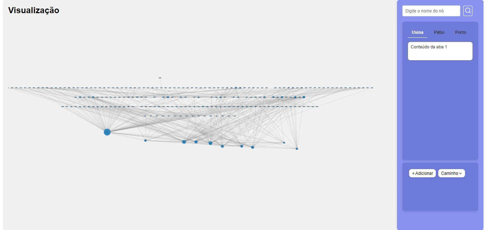

# Introdução

&emsp;&emsp;Em um contexto marcado por complexidades logísticas inerentes ao setor de mineração, a busca por soluções inovadoras que atendam aos altos padrões de qualidade e eficiência se torna premente. Este documento propõe o desenvolvimento de uma plataforma avançada e software que emprega modelagem de grafos e algoritmos de otimização para redefinir o planejamento logístico de uma das maiores empresas do ramo de mineração. Esta abordagem é direcionada para superar as dores frequentemente experimentadas na cadeia de suprimentos, como a dificuldade de planejamento devido ao uso de certas tecnologias  e a necessidade de decisões ágeis frente a demandas dinâmicas e imprevistos operacionais.

&emsp;&emsp;Por meio da análise detalhada das operações atuais, a vasta gama de minas e a complexidade de atender a variadas demandas de clientes com precisão, se destaca a necessidade de uma plataforma que ofereça maior visibilidade operacional e flexibilidade na tomada de decisões. Desta maneira, a tecnologia proposta almeja fornecer respostas mais ágeis e informadas, crucial para o sucesso logístico e para manter os fluxos de minério dentro dos parâmetros de eficiência e qualidade requeridos.

&emsp;&emsp;Este trabalho é fundamentado em uma extensa pesquisa sobre o uso da modelagem de grafos e algoritmos de otimização em desafios logísticos semelhantes, explorando a literatura científica atual e casos de estudo pertinentes. Relacionando diretamente com o nosso projeto, o estudo "OCTO SCM: optimizing iron ore supply chain exports"<sup>1</sup> e o artigo da McKinsey<sup>2</sup> sobre inovação digital na mineração oferecem insights valiosos e fundamentam a relevância e a aplicabilidade de nossa abordagem para enfrentar os desafios logísticos da empresa. A investigação revelou a existência de abordagens inovadoras em outros setores que podem ser adaptadas e aplicadas ao contexto da mineração para melhorar a eficiência logística e a tomada de decisões. Destacam-se, por exemplo, estudos sobre otimização de cadeias de suprimentos, otimização de rotas de entrega utilizando teoria dos grafos e aprendizado de máquina, e aplicação de algoritmos paramétricos de fluxo máximo em redes complexas. Essas pesquisas não apenas inspiraram a metodologia deste projeto, mas também reforçaram a viabilidade e o potencial impacto de nossa proposta.(Durrant-Whyte, H., Geraghty, R., Pujol, F., & Sellschop, R., 2015)(Lopes, Á.D.O., Rocha, H.R.O., Servare Junior, M.W.J., Moraes, R.E.N., Silva, J.A.L., & Salles, J.L.F., 2023)

&emsp;&emsp;Os materiais e métodos utilizados neste projeto incluem uma revisão bibliográfica abrangente, entrevistas com stakeholders, modelagem matemática para a construção de um modelo de otimização e desenvolvimento de um software integrado que implementa os algoritmos selecionados. O coração tecnológico da solução é o Neo4j, um banco de dados gráfico sofisticado, que permite modelar as complexas interações dentro da cadeia de suprimentos.

&emsp;&emsp;Além disso, para melhorar a interação do usuário com a plataforma, o projeto incorpora o React, uma biblioteca JavaScript, projetada para criar interfaces de usuário ricas e eficientes. Com o React, nosso objetivo é desenvolver um front-end responsivo e de fácil uso, que permita aos gestores e operadores da empresa em questão acessar e interagir com o sistema de otimização de maneira fluida, possibilitando um acompanhamento em tempo real das operações e facilitando a tomada de decisões baseadas em dados. Esta tecnologia será fundamental para estruturar e aprimorar a interface do usuário da plataforma, garantindo uma experiência intuitiva e focada na eficácia operacional, essencial para responder prontamente todas as dinâmicas do mercado e tambem ass complexidades operacionais do setor de mineração.

&emsp;&emsp;Os resultados preliminares obtidos a partir da implementação do modelo e dos algoritmos sugerem uma melhoria significativa na eficiência logística, com redução nos tempos de planejamento e aumento na precisão das decisões de distribuição. Estes resultados, discutidos mais detalhadamente na seção apropriada, validam nossa abordagem e destacam o potencial da modelagem de grafos e da otimização algorítmica para transformar o planejamento logístico na indústria de mineração.

&emsp;&emsp; Portanto, a integração de pesquisas avançadas sobre modelagem de grafos e otimização, juntamente com a aplicação prática de tecnologias inovadoras, coloca este projeto na vanguarda das soluções logísticas para a mineração. Espera-se que este trabalho não apenas resolva os desafios enfrentados pela instituição, mas também contribua para o avanço do conhecimento e das práticas no setor de mineração como um todo.

## Motivação 

&emsp;&emsp; Este projeto nasce da urgência de integrar de forma efetiva as operações de extração, processamento e transporte de minério, assegurando uma resposta ágil às flutuações do mercado e às exigências rigorosas de qualidade. Nosso objetivo transcende a simples adequação às expectativas do mercado; aspiramos a prever necessidades futuras e superá-las, elevando a logística de um mero requisito operacional a um ponto de vantagem competitiva palpável. Por meio da aplicação de modelagem de grafos e algoritmos de otimização, este projeto visa aperfeiçoar a coordenação entre as diversas etapas da cadeia de valor da mineração, minimizando atrasos, otimizando o uso de recursos e garantindo a entrega de produtos com a máxima eficiência.


&emsp;&emsp;Além disso, a inovação tecnológica no setor de mineração vem se mostrado como um vetor crucial não apenas para a eficiência operacional, mas também como um meio de atingir sustentabilidade a longo prazo. Estudos recentes, como os publicados no "Journal of Sustainable Mining" (Korre et al., 2020), destacam que o emprego de tecnologias avançadas, como a otimização baseada em algoritmos e modelagem de grafos, pode resultar em um uso mais racional dos recursos e em uma redução substancial do impacto ambiental. Essas tecnologias possibilitam não só a maximização do fluxo de minério, mas também garantem que as operações estejam alinhadas com as diretrizes ambientais e sociais de responsabilidade corporativa (Kippenberger, 2018).

&emsp;&emsp; Nesse mesmo aspecto, a análise detalhada das interações dos gerentes de logística com os sistemas já existentes revelou a urgência de desenvolver interfaces mais intuitivas, que permitam decisões rápidas e eficazes. Para além de complementar competências técnicas específicas e o uso de tecnologias avançadas, o projeto busca integrar funcionalidades de análise e controle de produção de ponta. 

&emsp;&emsp;Este esforço é motivado pela visão de que a logística é uma cadeia vital que, quando otimizada, pode reverberar com efeitos positivos em toda a empresa. Assim, a motivação proposta visa refinar cada elo dessa cadeia, desde a extração até a entrega final, utilizando análises avançadas para criar um sistema dinâmico que responda prontamente às variações do mercado e otimize os recursos.

&emsp;&emsp;Dessa mesma forma, a transformação digital tem se mostrado um vetor crucial para a evolução da cadeia logística na indústria de mineração, promovendo uma significativa melhoria na eficiência e na redução de custos operacionais. Conforme apontado por Johnson e Kumar (2022) em seu estudo publicado pela Harvard Business Review, a integração de tecnologias digitais avançadas, como Internet das Coisas (IoT), big data e inteligência artificial, permite uma visão diversificada e em tempo real das operações. Isso não apenas facilita a tomada de decisão baseada em dados, mas também melhora a precisão no planejamento e na execução da cadeia de suprimentos. assim, essas inovações representam uma mudança importante na forma como as mineradoras abordam suas cadeias logísticas, marcando o início de uma era de operações otimizadas e responsáveis” (Johnson & Kumar, 2022; Digital Mining Organization, 2023).

&emsp;&emsp; Atualmente, já existe um algoritmo que realiza as previsões e análises que a empresa precisa. No entanto, devido ao tempo necessário para executar o algoritmo, aproximadamente 90 minutos, surgiu a necessidade de implementar um novo modelo, o qual será mostrado adiante.

## Metodologia

&emsp;&emsp; A metodologia deste projeto busca atender parcialmente a demanda levantada, visto que as dimensões de tempo, como curto, médio e lonog prazo, e a diversidade de produtos não serão consideradas na pesquisa. Dessarte, serão abordados apenas as variáveis relativas ao caminho e quantidadede produto.

&emsp;&emsp; **Revisão Bibliográfica e Entrevistas com Stakeholders:** A primeira etapa consiste em realizar uma revisão bibliográfica de algoritmos que foram aplicados em desafios semelhantes ao nosso. Isso inclui uma análise crítica de estudos anteriores sobre modelagem de grafos e otimização de fluxos em redes complexas, especialmente aquelas pertinentes ao setor de mineração e logística. Além disso, realizamos entrevistas periódicas com os stakeholders (especialistas em logística e representantes desse setor) ao final de cada sprint. Essas discussões são cruciais para garantir que nosso entendimento do problema permaneça alinhado com as necessidades reais e as expectativas da empresa.

&emsp;&emsp; **Seleção de Algoritmos e Modelagem:** Com base na revisão bibliográfica e insights obtidos das entrevistas, selecionamos cuidadosamente algoritmos que oferecem a melhor adequação ao contexto proposto, focando naqueles que promovem eficiência, flexibilidade e capacidade de adaptação as dinâmicas operacionais da empresa. Esta fase também envolve a aplicação rigorosa de modelagem matemática para construir um modelo preciso que espelhe a complexidade do problema de logística enfrentado pela empresa. A modelagem em grafos, aqui, é empregada para representar as múltiplas rotas, usinas e portos, permitindo uma análise detalhada das possíveis vias de otimização do fluxo de minério.

&emsp;&emsp; **Desenvolvimento do Programa:** A construção do programa constitui a terceira etapa, onde a teoria se converte em aplicação prática. Esta fase abrange desde o design de uma interface de usuário intuitiva, que responda as necessidades dos operadores da firma, até a integração do modelo de otimização ao sistema. Utilizamos linguagens de programação  e frameworks de desenvolvimento para assegurar que o programa não só execute eficientemente o algoritmo desenvolvido, mas também seja acessível e fácil de usar para os gestores logísticos.

&emsp;&emsp; **Validação:** A etapa de validação é fundamental para assegurar a eficácia do modelo e do software desenvolvido. Utilizamos uma combinação de testes de uso com stakeholders, benchmarking comparativo com o sistema atualmente em uso e testes de usabilidade, para garantir então que a solução proposta atenda às expectativas e melhore significativamente a logística de distribuição de minério. A aplicação prática e a feedback contínuo dos usuários finais são cruciais para refinamentos subsequentes do sistema.

&emsp;&emsp; Portanto, esse método iterativo e baseado em feedback assegura que o projeto não apenas responda de forma efetiva as necessidades propostas, mas também seja adaptável o suficiente para enfrentar desafios futuros.


# Trabalhos relacionados

## 1° Pesquisa relevante: A Fast Parametric Maximum Flow Algorithm and Applications

&emsp;&emsp; Considerando a problemática que envolve a utilização de um modelo de Fluxo Máximo para transporte, é conveniente argumentar que o estudo sobre esta área é um precursor distinto para o sucesso do trabalho, avaliando a literatura que envolve este conceito. A partir disto, este artigo científico faz uma análise de aplicabilidade e parametrização de um algoritmo semelhante, reduzindo as múltiplas variáveis a um único parâmetro universal, do qual derivam as demais características considerando, ademais, as diferentes condições de satisfação do problema. 

### Artigo Referenciado

**Título**: A Fast Parametric Maximum Flow Algorithm and Applications
 
**Autor**: Giorgio Gallo, Michael D. Grigoriadis, and Robert E. Tarjan


### Principais Achados

&emsp;&emsp; O artigo aborda uma estratégia inovadora para a utilização de algoritmos, principalmente no viés que se propõe de redes paramétricas. O método que a análise realizada impõe para a aplicação das restrições dentro da problemática matemática também é muito interessante, podendo ser reestruturado para caber dentro da resolução proposta por este artigo. O compartilhamento de arestas, a viabilidade matemática e a ponderação de diferentes fluxos máximos através de resoluções lógicas são alguns dos pontos do artigo verdadeiramente interessantes a este projeto.

&emsp;&emsp; Em outro âmbito, o artigo desenvolvido trás nuances interessantes sobre a optimização de grafos e de complexidade computacional, trazendo, por exemplo, uma relação entre o tamanho do grafo e a quantidade de ciclos que o compõem com a notação de complexidade relacionada. Outra análise a ser visualizada é a de compartilhamento de fluxos para a otimização do fluxo máximo, ponderando a qualidade dos múltiplos fluxos máximos através de outros parâmetros distintos.
O estudo sugere, também, a utilização dos algoritmos de Goldberg e Tarjan para resolver uma sequência de O(n) problemas relacionados a fluxo máximo, se, é claro, cumprirem com as outras considerações propostas ao longo do texto, como arcos como funções lineares do parâmetro principal . 

---

&emsp;&emsp; Este artigo apresenta uma diferente proposta de abordagem, se comparada com a utilizada por este grupo. Entretanto, esta visão distinta demonstra outras nuances e soluções que eram desconhecidas até o momento e que podem ser interessantes para serem aplicadas, isto é, após uma reformulação e revisão congruente com o escopo esperado.


## 2° Pesquisa relevante: Otimização Robusta da Cadeia de Suprimentos de Minas sob Grandes Dados

&emsp;&emsp; A evolução tecnológica e a crescente acumulação de grandes volumes de dados tem um impacto significativo na eficiência da tomada de decisões em diversos setores, inclusive na gestão da cadeia de suprimentos de mineração. O artigo em análise se concentra na otimização da cadeia de suprimentos de minas na era dos grandes dados, enfrentando desafios específicos como a variação do grau de corte por meio de um modelo de otimização robusta. 

&emsp;&emsp; Este estudo propõe uma metodologia pra de certa forma linearizar as restrições não lineares e emprega testes de hipóteses para definir valores de parâmetros específicos, visando resolver o modelo proposto e garantir sua estabilidade frente a perturbações nos parâmetros. A análise sensível a diferentes parâmetros também é realizada para avaliar a influência de cada um sobre o modelo.

### Artigo Referenciado

**Título:** Otimização Robusta da Modelagem da Cadeia de Suprimentos de Minas sob Grandes Dados

**Autor:** Wenbo Liu

### Principais Achados

&emsp;&emsp; Este estudo propõe uma abordagem inovadora, centrada na utilização de um algoritmo paramétrico rápido de fluxo máximo e suas aplicações, visando não apenas melhorar a eficiência e reduzir custos, mas também adaptar-se flexivelmente às incertezas inerentes ao processo. A metodologia destacada aqui representa um passo significativo na direção de operações de mineração mais resilientes e adaptáveis, estabelecendo um novo padrão para a otimização da cadeia de suprimentos no setor.

&emsp;&emsp; Dessa forma, a metodologia proposta aborda a complexidade da cadeia de suprimentos de minas integrando mineração, processamento e transporte, com um enfoque na otimização da eficiência e na redução de custos.Além disso, por meio da aplicação de testes de hipótese e análises robustas, o estudo demonstra a viabilidade de ajustar os modelos de otimização para lidar com incertezas e perturbações nos dados, mantendo a estabilidade e a otimização dos resultados. E também, a investigação realiza uma análise de sensibilidade, destacando a importância da capacidade de mineração e do grau de corte na otimização geral da cadeia de suprimentos.

&emsp;&emsp; Assim, esse estudo ressalta a relevância da aplicação de técnicas avançadas de análise de dados e otimização no contexto da cadeia de suprimentos de mineração, proporcionando insights valiosos para a melhoria contínua da eficiência operacional e redução de custos. A introdução de tecnologias inovadoras e a modelagem avançada são fundamentais para superar os desafios logísticos, tornando-se essenciais para o desenvolvimento de soluções eficazes que atendam às necessidades dinâmicas do setor.

---

&emsp;&emsp; Tendo isso em vista, o projeto desenvolvido, com foco na utilização de modelagem de grafos e algoritmos de otimização para aprimorar o planejamento logístico, encontra paralelos diretos com as abordagens e resultados discutidos no artigo sobre otimização robusta da cadeia de suprimentos de minas sob grandes dados. 

&emsp;&emsp; Esta relação destaca a importância da inovação tecnológica, como a implementação do sistema de gerenciamento de banco de dados gráfico Neo4j, para superar os desafios operacionais e logísticos enfrentados pelo setor de mineração. Assim, a integração de soluções avançadas no projeto visa não apenas otimizar a eficiência logística, mas também promover um sistema mais adaptável, alinhando-se com as necessidades dinâmicas e os padrões de qualidade exigidos, e reforçando o papel das tecnologias digitais como catalisadores de mudança e otimização no planejamento e gestão da cadeia de suprimentos.

## 3° Pesquisa relevante: Otimização de Rotas de Entrega Utilizando Teoria dos Grafos e Aprendizado de Máquina.

&emsp;&emsp;A pesquisa sobre Otimização de Rotas se aprofunda na utilização inovadora de algoritmos e modelagem para otimização de rotas em ambientes urbanos multifacetados, uma abordagem que se mostra crucial para melhorar a eficácia dos processos logísticos. Esta otimização abrange a complexidade do planejamento desde a fabricação até a entrega, envolvendo múltiplos pontos de origem e destino, essencial para um sistema de entrega urbanizado e eficiente.

### Artigo Referenciado

*Título*:  Otimização de Rotas de Entrega Utilizando Teoria dos Grafos e Aprendizado de Máquina. 

*Autor*: Omdena.

### Principais Achados

&emsp;&emsp;O estudo realizado por Omdena para a Carryt integra métodos de teoria dos grafos e aprendizado de máquina para enfrentar os desafios do Problema de Roteamento de Veículos (VRP) e suas variações. A proposta resultou em rotas de entrega significativamente mais eficientes, com a notável redução das distâncias percorridas e das emissões de CO2. Esta aplicação não só otimizou as rotas, mas também trouxe "insights" sobre a flexibilidade da solução, podendo ser adaptada a diferentes cenários e complexidades de redes, seja no caos urbano ou nos processos industriais com múltiplas origens e destinos.

&emsp;&emsp;Contudo, a precisão nas rotas otimizadas é uma preocupação constante, especialmente quando submetida nas restrições inerentes aos diferentes contextos aplicados. Enquanto o estudo mostrou eficiência, há uma busca contínua para garantir a acurácia dentro dos limites das restrições impostas.

&emsp;&emsp;Dessa forma, e considerando o ambiente industrial, o modelo apresentado pode melhorar significativamente a eficiência logística, criando rotas que interligam as etapas de fabricação de forma mais eficaz. O impacto dessa melhoria vai além de economia de tempo e recursos, posicionando-se como um vetor para práticas de produção sustentáveis, que estão se tornando cada vez mais importantes no cenário atual..

&emsp;&emsp;Como direcionamento para trabalhos futuros, o estudo abre caminho para a expansão da abordagem para redes de complexidade ainda maior e uma variedade mais ampla de cenários. Existe um potencial inexplorado para aplicar estas estratégias em cidades de grande extensão e com demandas de roteamento mais intensas, possivelmente utilizando grafos sintéticos para aprofundar a análise.

---

&emsp;&emsp;Portanto, a incorporação dessas estratégias inovadoras de teoria dos grafos e aprendizado de máquina no projeto da Vale promete transformar fundamentalmente o planejamento e a execução das rotas de transporte de minério. E assim, o potencial para otimizar a logística não só reforça a eficiência operacional, mas também promove uma consonância estratégica com as metas de sustentabilidade ambiental. Esta amostra então de eficácia e responsabilidade ambiental evidencia uma trajetória promissora de inovação e aprimoramento contínuo no campo da mineração.

# Algoritmos adotados para resolver o problema

&emsp;&emsp;Para abordar os desafios logísticos do stakeholder, o projeto se concentra no uso de dois algoritmos de otimização de fluxo de rede: o algoritmo de Dinic e o algoritmo de Ford-Fulkerson.

## Algoritmo de Dinic:

### Descrição
&emsp;&emsp;O algoritmo de Dinic é uma estratégia eficiente para encontrar o fluxo máximo em uma rede. Ele se baseia na construção de níveis e a busca em camadas para achar o fluxo bloqueante em uma rede. Esse algoritmo se destaca pela sua capacidade de manejar redes com múltiplas fontes e sumidouros, sendo adequado para situações complexas como as encontradas na logística da instituição.

&emsp;&emsp;Para ilustrar a implementação do algoritmo, segue o pseudocódigo :

### Pseudocódigo de Dinic:

```plaintext
função Dinic(G, S, T):
    inicializa fluxo como 0
    enquanto verdade:
        construir grafo de níveis L usando BFS
        se T não é alcançável em L:
            retorna fluxo
        enquanto verdade:
            encontrar fluxo bloqueante f em L
            se f é 0:
                interrompe
            aumentar fluxo por f
            atualizar capacidades residuais em G e L
```

- **Inicialização**: Inicia o fluxo como 0.
Construção do Grafo de Níveis: Utiliza uma busca em largura (BFS) para construir o grafo de níveis.

- **Verificação de Alcance:** Verifica se o sumidouro T pode ser alcançado no grafo de níveis.

- **Fluxo Bloqueante:** Encontra o fluxo bloqueante no grafo de níveis.

- **Atualização:** Atualiza o fluxo e as capacidades residuais conforme necessário.
### Vantagens
- **Eficiência para Redes Densas**: Particularmente eficaz em redes densas, o algoritmo de Dinic pode tratar com eficiência os vastos e intricados sistemas logísticos da empresa em questão.
- **Determinação de Fluxo Bloqueante**: Permite uma avaliação clara de onde os gargalos de fluxo estão ocorrendo, possibilitando ações direcionadas para a sua melhoria.

### Desvantagens
- **Complexidade**: Pode ser complexo de implementar e entender, especialmente em redes de grande escala com muitas variáveis.
- **Desempenho em Redes Esparsas**: Em redes com poucas conexões, outros algoritmos podem ser mais rápidos.

## Algoritmo de Ford-Fulkerson:

### Descrição
&emsp;&emsp;O algoritmo de Ford-Fulkerson aborda o problema de fluxo máximo ao encontrar caminhos aumentativos na rede, aumentando o fluxo até que não seja possível encontrar mais nenhum caminho aumentativo. Esse método é versátil e intuitivo, tornando-o uma escolha popular para problemas de otimização de fluxo.

&emsp;&emsp;Para ilustrar a implementação do algoritmo, segue o pseudocódigo :

### Pseudocódigo de Ford-Fulkerson :

```
função FordFulkerson(G, S, T):
    inicializa fluxo como 0
    enquanto existe um caminho de S para T no grafo residual Gf:
        encontrar o caminho P usando DFS ou BFS
        encontrar a capacidade residual mínima Cf ao longo de P
        aumentar fluxo ao longo de P por Cf
        atualizar capacidades residuais em Gf
    retorna fluxo
```
- **Inicialização**: Inicia o fluxo como 0.
- **Busca de Caminho:** Procura um caminho do nó fonte S ao sumidouro T no grafo residual.
 
- **Capacidade Residual** Mínima: Encontra a capacidade residual mínima ao longo do caminho encontrado.
- **Atualização do Fluxo:** Aumenta o fluxo ao longo do caminho pelo valor da capacidade residual mínima.
- **Atualização do Grafo Residual:** Atualiza as capacidades residuais no grafo residual.

### Vantagens
- **Flexibilidade**: Pode ser aplicado em uma variedade de contextos e tipos de redes, tornando-o versátil para as operações multifacetadas da firma.
- **Intuitivo e Simples de Implementar**: Sua simplicidade e abordagem passo a passo facilitam a compreensão e implementação.

### Desvantagens
- **Problemas com Fluxos Irrestritos**: Pode não ser eficiente em casos onde o fluxo pode ser arbitrariamente grande, levando a um tempo de execução potencialmente infinito.
- **Sensível à Escolha de Caminhos Aumentativos**: A eficiência do algoritmo pode ser comprometida pela escolha subóptima dos caminhos aumentativos.

### Importância no Projeto
&emsp;&emsp;Para o problema apresentado, o Ford-Fulkerson é crucial para modelar e melhorar o fluxo logístico, permitindo uma análise dinâmica e adaptativa das rotas e capacidades de transporte, essencial para lidar com as demand   as variáveis e as condições operacionais. Por outro lado, o algoritmo de Dinic proporciona um meio robusto para mapear e otimizar os fluxos complexos de transporte e distribuição de minério, facilitando a identificação e resolução de gargalos.

### Conclusão


| Algoritmo     | Melhor Caso              | Pior Caso                    |
|---------------|--------------------------|------------------------------|
| Ford-Fulkerson| O(max_flow * E)          | O(V * E^2)                   |
| Dinic         | O(V^2 * E)               | O(V^2 * E)                   |

- **V** representa o número de vértices no grafo.
- **E** representa o número de arestas no grafo.
- **max_flow** representa o fluxo máximo possível no grafo.

&emsp;&emsp;No melhor caso, a complexidade de Ford-Fulkerson depende do valor do fluxo máximo e do número de arestas, enquanto Dinic tem uma complexidade dependente do quadrado do número de vértices e do número de arestas. No pior caso, Ford-Fulkerson pode ter uma complexidade quadrática com base no número de vértices e quadrática no número de arestas, enquanto Dinic mantém a complexidade dependente do quadrado do número de vértices e linear no número de arestas.

&emsp;&emsp;Por isso, os algoritmos de Dinic e Ford-Fulkerson oferecem abordagens complementares para otimizar a logística. Enquanto o Dinic se destaca na eficiência para redes densas e complexas, o Ford-Fulkerson traz flexibilidade e simplicidade. A combinação desses métodos permite uma solução abrangente que endereça tanto a complexidade das operações quanto a necessidade de adaptação e melhoria contínua, alinhando-se com o objetivo de aprimorar a eficiência logística e a sustentabilidade operacional da instituição.

# Resultados obtidos

&emsp;&emsp; A partir das demandas levantadas pela empresa, da revisão bibliográfica de artigos relacionados e o estudo dos algoritmos de Ford-Fulkerson e Dinic, foi modelado matematicamente o problema proposto. Na realização, foram executados os algoritmos sobre uma representação detalhada da rede logística da empresa, resultando na identificação de 406 lotes operacionais. Estes lotes, simulações de operações de transporte dentro do complexo sistema da instituição, serão posteriormente convertidos em toneladas de minério, proporcionando uma estimativa precisa do fluxo de minério para cada produto. Este processo valida a eficácia dos algoritmos em replicar a realidade operacional da empresa sob algumas condições específicas.

&emsp;&emsp; No entanto, é crucial reconhecer as limitações da solução. Embora os algoritmos selecionados sejam robustos e adequados para a modelagem do problema logístico, é importante ressaltar que o ambiente operacional da empresa é complexo e dinâmico, apresentando uma variedade de variáveis ​​e restrições que podem não ser totalmente capturadas pelo modelo. Além disso, as limitações de tempo também desempenham um papel significativo, impedindo uma análise abrangente de todas as nuances do problema.

&emsp;&emsp; Portanto, embora os resultados obtidos forneçam insights valiosos e contribuam para uma compreensão mais aprofundada da operação logística da empresa, é essencial reconhecer que o modelo apresenta algumas simplificações e não consegue abordar todas as esferas do problema devido às restrições de tempo e complexidade.


## Análise Matemática

&emsp;&emsp;A análise de tais resultados é crucial para a solução desenvolvida. Um dos resultados encontrados através do algoritmo implementado pelo grupo foi o fluxo máximo. O fluxo pode ser representado como sendo a quantidade que sai da super fonte, sendo que todos os nós produtores, como usinas e fornecedores, estão conectados à essa super fonte. Representando matematicamente:

$$ \sum_{n} X_{s \ n} $$


Onde “s’” representa a super fonte e “n” cada nó que ele se conecta, ou seja, os nós produtores.

&emsp;&emsp;O responsável pelos resultados obtidos foi principalmente o algoritmo de Dinic, responsável por calcular o fluxo máximo e o grafo resultante. Além disso, o algoritmo demonstrou resultados positivos em relação ao tempo de execução, sendo mais rápido do que o atual algoritmo da instituição. O fator que torna isso possível é a sua baixa complexidade, que é dada por:

$$ O(V^2 \cdot E) $$

Onde "V" representa o número de vértices e "E" o número de arestas.


## Integração com o front-end

&emsp;&emsp;Foi realizada também a integração de um front-end personalizado e prático. Em que o usuário é capaz de visualizar os grafos e caminhos de forma eficiente otimizando a navegação e tomada de decisões. Observe a figura abaixo: 

<p align="center">Figura 1 - Integração front-end</p>

<p align="center">
    
</p>
<p align="center">Fonte: Autoria Própria</p>

# Conclusão

&emsp;&emsp;A conclusão deste projeto marca um avanço significativo na abordagem de desafios logísticos da Vale, demonstrando o potencial transformador da modelagem de grafos e algoritmos de otimização. A eficácia dos algoritmos de Dinic e Ford-Fulkerson na otimização do fluxo de minério evidencia uma gestão logística inovadora, capaz de se adaptar dinamicamente às complexidades operacionais e às demandas do mercado.

&emsp;&emsp;Os desafios enfrentados e superados pelo Minet, especialmente na integração de tecnologias avançadas e interpretação de dados complexos, não apenas provaram a viabilidade da nossa solução, mas também aprimoraram nossa capacidade de inovação. O diálogo constante com stakeholders fundamentou o alinhamento do projeto com as necessidades reais da Vale, destacando a importância da cooperação para o sucesso de iniciativas tecnológicas.

&emsp;&emsp;O projeto ressaltou a necessidade de sistemas tecnológicos que acompanham o crescimento e a evolução da empresa. A capacidade de atualização e expansão do sistema sugere um caminho promissor para a adoção futura de tecnologias emergentes, como análises avançadas e IoT, para aprimorar ainda mais a eficiência operacional.

&emsp;&emsp;Olhando para o futuro, o potencial de aplicar as inovações deste projeto em outras áreas da Vale é notável. A versatilidade dos algoritmos e a modelagem de grafos podem revolucionar a eficiência operacional e a tomada de decisões em diversos setores da empresa, reforçando a posição da tecnologia como um diferencial competitivo essencial. Além disso, a disseminação desse conhecimento tem o potencial de inspirar práticas similares em outras empresas do setor, contribuindo para uma transformação positiva e abrangente na indústria de mineração.

&emsp;&emsp;Em suma, o projeto Minet não só atendeu às expectativas iniciais, mas também abriu caminho para novas possibilidades de otimização logística e sustentabilidade operacional. As lições aprendidas e a experiência adquirida posicionam a Vale na vanguarda da inovação no setor de mineração, pronta para enfrentar os desafios do futuro com soluções cada vez mais eficientes e responsáveis.

### Pontos a Desenvolver no Projeto Minet : Além do MVP

&emsp;&emsp;Após a conclusão do projeto Minet, foram identificadas algumas áreas que necessitam de atenção e melhoria para o desenvolvimento futuro do sistema e para garantir sua eficácia e eficiência a longo prazo. Estas áreas são:

#### 1. Redução do Tempo de Execução do Algoritmo

- **Problema Identificado:** O tempo necessário para a execução do algoritmo atual, pode ser considerado elevado para decisões logísticas que exigem rapidez.
- **Sugestão de Melhoria:** Otimizar o código e explorar algoritmos mais eficientes em termos de complexidade computacional para reduzir significativamente o tempo de processamento.

#### 2. Interface de Usuário e Experiência do Usuário

- **Problema Identificado:** A necessidade de desenvolver mais features da interface mais intuitiva do projeto Minet que facilitam a tomada de decisões rápidas e eficazes.
- **Sugestão de Melhoria:** Melhorar a interface de usuário (UI) e a experiência do usuário (UX) do sistema para garantir que os operadores da instituição possam interagir com o sistema de maneira mais eficiente e eficaz.

#### 3. Adaptação a Mudanças Dinâmicas

- **Problema Identificado:** A cadeia de suprimentos da empresa em questão é dinâmica e sujeita a alterações frequentes, o que requer uma resposta rápida do sistema.
- **Sugestão de Melhoria:** Implementar um sistema mais adaptável e flexível, capaz de ajustar-se rapidamente às mudanças nas demandas logísticas e padrões operacionais.

#### 4. Escalabilidade do Sistema

- **Problema Identificado:** A necessidade de expandir o sistema para acomodar o crescente volume de dados e as complexidades logísticas da empresa.
- **Sugestão de Melhoria:** Assegurar que a arquitetura do sistema seja escalável, permitindo uma fácil expansão e integração com outras áreas da empresa.

#### 5. Integração e Sincronização de Dados

- **Problema Identificado:** Desafios na integração e sincronização de dados de diferentes fontes e sistemas dentro da firma.
- **Sugestão de Melhoria:** Aprimorar a capacidade de integração de dados do sistema, garantindo uma sincronização eficiente e confiável entre diferentes fontes de dados.

#### 6. Análise e Uso de Dados em Tempo Real

- **Problema Identificado:** A necessidade de utilizar dados em tempo real para melhorar a tomada de decisões e a precisão das análises.
- **Sugestão de Melhoria:** Implementar recursos que permitam a análise e o uso de dados em tempo real, melhorando a agilidade e a precisão do sistema.

#### 7. Treinamento e Suporte aos Usuários

- **Problema Identificado:** A complexidade do sistema pode dificultar seu uso eficiente pelos operadores sem treinamento adequado.
- **Sugestão de Melhoria:** Desenvolver programas de treinamento e suporte contínuo para os usuários, garantindo que eles possam utilizar o sistema de forma eficaz.

&emsp;&emsp;Esses pontos de melhoria são essenciais para o aprimoramento contínuo do projeto Minet, visando não apenas otimizar a eficiência logística do stakeholder, mas também garantir que o sistema seja sustentável, adaptável e capaz de atender às demandas futuras do setor de mineração.

### Considerações finais e Projeções Futuras do Grupo Minet:

1. **Adaptação e Flexibilidade:** A experiência reiterou a importância de adaptar e flexibilizar as estratégias logísticas frente às complexidades e variabilidades inerentes ao setor de mineração. Como por exemplo, interrupções inesperadas na cadeia de suprimentos
2. **Integração Tecnológica e Inovação:** O projeto evidenciou o papel crítico da integração tecnológica e da inovação na superação dos desafios logísticos. A aplicação do Neo4j como banco de dados gráfico pelo grupo transformou a maneira de analisar e visualizar as rotas logísticas, permitindo identificar eficientemente os gargalos e otimizar os trajetos de transporte do minério.
3. **Colaboração e Comunicação:** A interação constante com os stakeholders e a colaboração entre as equipes foram fundamentais para o alinhamento das soluções.
4. **Sustentabilidade e Responsabilidade Social:** O projeto contribuiu para um entendimento de como as práticas logísticas podem ser alinhadas com objetivos de sustentabilidade, já que pode incentivar à adoção de rotas mais eficientes e à redução do consumo de combustível, diminuindo assim a pegada de carbono da empresa.
5. **Projeções Futuras:** Expandir o uso do algoritmo de otimização para outras áreas da empresa, como a distribuição de recursos humanos e a gestão de equipamentos, para maximizar a eficiência operacional em toda a empresa.
6. **Expansão e Escalabilidade:** O sucesso do projeto abre caminhos para a sua expansão e aplicação em outras áreas.
7. **Educação e Desenvolvimento Profissional:** O projeto incentivou a formação de uma força de trabalho capaz de enfrentar os desafios futuros com inovação.

&emsp;&emsp; Tendo tudo o que foi citado em vista, a jornada do grupo Minet desvendou a relevância de uma abordagem interdisciplinar na solução de problemas complexos. A combinação de conhecimento técnico e compreensão de certas partes da indústria de mineração permitiu não apenas a aplicação eficaz de teorias matemáticas em contextos reais, mas também pavimentou o caminho para a introdução de práticas mais ágeis e informadas de gestão logística. O projeto destacou como a inovação metodológica, respaldada por uma base teórica sólida e uma compreensão aprofundada das necessidades operacionais, pode resultar em melhorias significativas na produtividade e na sustentabilidade. Assim, as iniciativas de Minet deixaram um horizonte de possibilidades, sugerindo que os métodos e técnicas desenvolvidos tem o potencial de serem replicados e adaptados para enfrentar desafios semelhantes em outros setores e geografias, incentivando assim um ciclo contínuo de melhoria e inovação no panorama industrial global.

&emsp;&emsp; Portanto, o projeto Minet representou uma jornada valiosa de aprendizado e inovação, culminando em um sistema de otimização logística que não apenas atende às demandas atuais da empresa, mas também oferece a flexibilidade necessária para se adaptar a futuras mudanças e desafios no setor de mineração. Esse trabalho não somente reforça a importância da inovação tecnológica para a eficiência operacional, mas também destaca o potencial de abordagens analíticas avançadas para transformar a logística e a gestão de cadeias de suprimentos no contexto global..

# Referências Bibliográficas

- DURRANT-WHYTE, H.; GERAGHTY, R.; PUJOL, F.; SELLSCHOP, R. How digital innovation can improve mining productivity. McKinsey & Company, 1 nov. 2015. Disponível em: https://www.mckinsey.com/industries/metals-and-mining/our-insights/how-digital-innovation-can-improve-mining-productivity. Acesso em 22 de fevereiro de 2024.

- GALLO, G.; GRIGORIADIS, M. D.; TARJAN, R. E. A Fast Parametric Maximum Flow Algorithm and Applications. *Hindawi*, 2021. Disponível em: https://www.hindawi.com/journals/wcmc/2021/1709363/. Acesso em 11 março de 2024.

- OMDENA. Otimização de Rotas de Entrega Utilizando Aprendizado de Máquina no Setor de Logística. *Omdena*, 23 jun. 2022. Disponível em: https://www.omdena.com/blog/optimizing-delivery-routes-using-ml-and-graph-theory. Acesso em 12 março de 2024.

- ALGORITMOS: teoria e prática. 3. ed. São Paulo: GEN LTC, 2012. 1 recurso online. ISBN 9788595158092. Disponível em: https://integrada.minhabiblioteca.com.br/books/9788595158092. Acesso em 12 de março de 2024.

- BAKHTAVAR, E.; SHAHRIAR, K.; ORAEE, K. Mining method selection and optimization of transition from open pit to underground in combined mining. Arch. Min. Sci., 2009, 54, 481–493. Disponível em: https://www.researchgate.net/publication/46302299_Mining_Method_Selection_and_Optimization_of_Transition_from_Open_Pit_to_Underground_in_Combined_Mining/. Acesso em 12 de março de 2024.

- KORRE, A., et al. "Innovation in Mining: Review and Framework." Journal of Sustainable Mining, vol. 19, no. 2, 2020, pp. 112-120. Acesso em 23 de março de 2024.

- JOHNSON, M., & KUMAR, A. "Digital Transformation: A Comprehensive Guide to the Mining Sector." Harvard Business Review, 2022.

- SMITH, M., & Zhang, L. (2024). Digital transformation in the mining industry: Driving sustainability through technology. Journal of Sustainable Mining. Acesso em: 26 de março de 2024.

- ACERVO LIMA. "Algoritmo de Dinic para Fluxo Máximo." Disponível em: https://acervolima.com/algoritmo-de-dinic-para-fluxo-maximo/. Acesso em: 28 de março de 2024.

- React Team. (2022). React: A JavaScript library for building user interfaces. Disponível em: https://reactjs.org. Acesso em: 20 de março de 2024.
