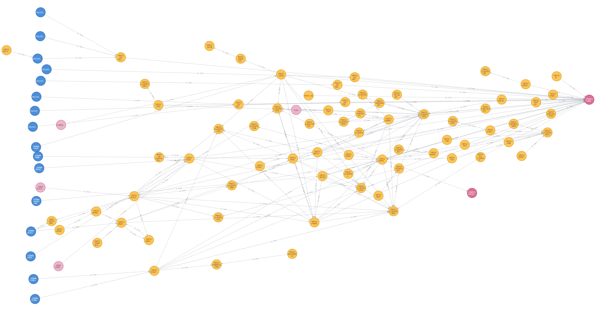

## Entendimento do Contexto do Problema

&emsp;&emsp;O problema passado pela Vale é um problema de fluxo máximo, onde a otimização está relacionada ao transporte de minério entre usinas de origem, entrepostos e portos. Para entender o problema da Vale é importante destacar a rede que estamos considerando, Sistema Sudeste, em conjunto com os agentes importantes desse sistema.

&emsp;&emsp;A Vale possui três tipos de usina, a primeira sendo de beneficiamento, que é responsável pelo      processamento dos minérios que chegam das minas. Os outros dois tipos de usina são de  britagem e pelotização que recebem o minério já processado pela usina de beneficiamento e realizam transformações nele. O grupo considera que as usinas de benficiamento serão as fontes da rede de grafos.

&emsp;&emsp;Os portos são o principal destino do minério e são considerados os sumidouros no nosso problema de fluxo máximo. Depois dos portos, os minérios são enviados para os clientes, porém isso não será considerado no escopo do projeto. Além disso, os entrepostos são os pontos que conetam as usinas com os portos. Os entrepostos podem conectar entre si e ajudam que as usinas estejam conectadas a todos os portos que forem necessários.

&emsp;&emsp;Os dados disponíveis para essa modelagem incluem informações sobre as usinas, entrepostos e postos, as capacidades de produção e estoque de cada nó. Também contém informações de transporte (trajetos, capacidades, modal) e produto (minério). Além disso, dados de clientes e fornecedores. O objetivo é maximizar o fluxo de minério, isto é:

&emsp;&emsp;Função Objetivo :  $$MaxF = \sum_n X_{np'} $$

&emsp;&emsp; ou $$MaxF = \sum_n X_{s'n}  $$ 

&emsp;&emsp;Obs: *Xij* representam o valor as conexões entre os nós do grafo. Sendo *i* e *j* os nós, que representam as usinas de beneficiamento, entrepostos ou portos.

&emsp;&emsp;A tomada de decisão envolve determinar as quantidades de minério a serem transportadas entre os diferentes locais, ou seja, as variáveis de decisão são os fluxos de minério (em toneladas) de um nó para outro:

*Xij*=Quantidade de minério a ser transportada de um nó a outro.

&emsp;&emsp;No entanto, uma limitação importante a ser considerada é que cada lote de transporte de minério  na região sudeste não pode exceder a capacidade máxima de 84 vagões. Além disso, cada entreposto de estoque possui sua capacidade de armazenamento:

&emsp;&emsp;Restrições:
- O fluxo de determinada aresta tem que ser maior ou igual a zero e menor que a capacidade da aresta
  
$$ 0 \leq X_{i, j} \leq c_{i, j}, \forall (i, j) $$   

- O fluxo que saí de determinada aresta tem de ser igual ao fluxo que entra em determinada aresta, com exceção da superfonte e o sumidouro.

$$ \sum_j X_{i, j} = \sum_k X_{k, i}, \forall i \ne s', p' $$

- O fluxo que saí da superfonte tem que ser igual ao fluxo que entra no sumidouro

$$ \sum_n X_{s'n} = \sum_n X_{np'}$$

&emsp;&emsp;Considerando a função objetivo, as restrições e a tomada de decisão, é possível montar o seguinte grafo:

  
<b>Figura 1 </b>- Representação visual dos grafos 

  
  
Fonte: elaborado por MiNet

| Sigla | Nome                        | Aresta     | Descrição                                                            |
| ----- | --------------------------- | ---------- | -------------------------------------------------------------------- |
| S'    | Superfonte                  | ∞          | Representa a super fonte de todas as zonas de abastecimento da Vale. |
| S1    | Zona Abastecimento          | w1, w2, w3 | Representa uma das zonas de abastecimento.                           |
| S2    | Zona Abastecimento          | w4, w5, w6 | Representa outra zona de abastecimento.                              |
| S3    | Zona Abastecimento          | w7, w8, w9 | Representa outra zona de abastecimento.                              |
| E1    | Entreposto 1                | w10        | Representa o entreposto 1 para distribuição.                         |
| E2    | Entreposto 2                | w11        | Representa o entreposto 2 para distribuição.                         |
| E3    | Entreposto 3                | w12        | Representa o entreposto 3 para distribuição.                         |
| E4    | Entreposto 2 (ex: Drummond) | w13        | Representa o entreposto anteriormente conhecido como Drummond.       |
| P     | Porto                       | w14        | Representa o porto para exportação.                                  |
| P'    | Sumidouro                   | -          | Representa o sumidouro das zonas de abastecimento.                   |

  
<b>Figura 2 </b>- Caminho Exemplo 

  
  
Fonte: elaborado por MiNet

&emsp;&emsp;Na figura apresentada, é possível identificar um diagrama de fluxo que representa um caminho específico em um sistema de distribuição ou rede logística. O caminho pode ser descrito matematicamente usando notação LaTeX, que é frequentemente empregada para apresentar equações e fórmulas de maneira elegante e precisa.

&emsp;&emsp;O caminho começa na Superfonte (S'), passa por múltiplas zonas de abastecimento (S1, S2, S3), através de entrepostos (E1, E2, E3, E4), e chega ao Porto (P) antes de terminar no Sumidouro (P'). As arestas que conectam esses nós podem representar, por exemplo, estradas ou rotas de transporte, e têm identificadores como w1, w2, w3, etc.

&emsp;&emsp;Aqui está como é descrito na imagem :

$$\text{Caminho: } S' \xrightarrow{w4} S2 \xrightarrow{w5} E2 \xrightarrow{w11} E4 \xrightarrow{w13} P \xrightarrow{w14} P'$$

&emsp;&emsp;A figura apresentada ilustra um caminho específico dentro de uma rede de distribuição, que pode representar um sistema logístico ou de abastecimento, iniciando na 'Superfonte' e terminando no 'Sumidouro'. O caminho detalhado realça as conexões e a sequência de nós que são percorridos, desde a origem até o destino final.

&emsp;&emsp;Conclui-se que a capacidade de modelar visualmente e descrever matematicamente esses caminhos é crucial para a análise e otimização de sistemas de distribuição. Essa representação facilita a compreensão das rotas de transporte e pode ser utilizada para melhorar a eficiência logística, minimizar custos ou maximizar o throughput dentro da rede. Além disso, oferece uma representação clara e padronizada que é amplamente utilizada em contextos acadêmicos e profissionais, permitindo uma comunicação precisa entre os interessados.

<!-- Colocar um svg -->

  
<b>Figura 3 </b>- Grafo inicial com dados

  
  
Fonte: elaborado por MiNet

## Seleção de Algoritmos

### Algoritmo de Dinic

&emsp;&emsp;O algoritmo de Dinic foi proposto por Yefim Dinitz em 1970 e é conhecido por sua complexidade assintótica mais baixa em comparação com o algoritmo de Edmonds-Karp. O algoritmo de Dinic trabalha com um grafo residual, que é uma representação modificada do grafo original após o fluxo ter sido enviado. O algoritmo usa um conceito chamado “nível do grafo” para otimizar o processo de busca por caminhos aumentantes.

&emsp;&emsp; Assim, a inovação trazida pelo algoritmo de Dinic, especialmente sua abordagem de "nível do grafo", revolucionou a forma como os problemas de fluxo máximo são abordados. Ao dividir o problema em camadas, facilita a identificação de caminhos aumentantes, agilizando significativamente a busca por soluções ótimas. Esta metodologia não só otimiza o processo computacional como também oferece uma perspectiva clara para a análise estrutural de redes complexas. Essa eficiência faz do algoritmo de Dinic uma ferramenta valiosa na otimização de sistemas logísticos, contribuindo para a solução de desafios de fluxo em larga escala enfrentados por empresas como a Vale.

**Passos do Algoritmo**:  
	- **Inicialização**: Começamos com o grafo residual igual ao grafo original.  
    - **Construção do Grafo de Níveis**:  
        &emsp;&emsp;- Usamos uma busca em largura (BFS) para atribuir níveis a todos os vértices.  
        &emsp;&emsp;- O nível de um vértice é a menor distância (em termos de número de arestas) desse vértice à fonte.  
    - **Envio de Fluxo**:  
        &emsp;&emsp;- Enquanto houver um caminho aumentante no grafo de níveis, continuamos enviando fluxo.  
        &emsp;&emsp;- O caminho aumentante deve ter vértices com níveis consecutivos (0, 1, 2, …).  
        &emsp;&emsp;- O algoritmo envia múltiplos fluxos simultaneamente, otimizando em relação ao Edmonds-Karp.  
        
&emsp;&emsp;O algoritmo de Dinic tem uma complexidade de tempo de **O(EV²)**, onde E é o número de arestas e V é o número de vértices. Essa complexidade é melhor do que o **O(VE²)** do Edmonds-Karp. Por conta da menor complexidade, o algoritmo de Dinic foi o primeiro escolhido entre os algoritmos para resolver o problema de fluxo proposto pela Vale.

### Algoritmo de Goldberg-Tarjan

&emsp;&emsp;Na década de 1980, os pesquisadores **Andrew V. Goldberg** e **Robert E. Tarjan** trabalharam na busca por um algoritmo mais eficiente para o problema do fluxo máximo. Porque embora o algoritmo de Ford-Fulkerson seja eficaz, ele não garante convergência para todas as redes. Eles desenvolveram uma abordagem que incorporava a estrutura de dados de **árvores dinâmicas** para melhorar a convergência e a eficiência do algoritmo. A versão final do algoritmo, conhecida como **algoritmo de Goldberg-Tarjan**, foi publicada em 1988. Ele utiliza a técnica de **pré-fluxo** e a estrutura de **árvores dinâmicas** para alcançar uma das complexidades mais baixas conhecidas para o problema do fluxo máximo.

&emsp;&emsp;Este aprofundamento na técnica de Goldberg-Tarjan, por Goldberg e Tarjan, marcou um avanço significativo na resolução de problemas de fluxo máximo, oferecendo uma abordagem inovadora que equilibra eficiência e complexidade. A incorporação de árvores dinâmicas e pré-fluxo não apenas aprimorou a capacidade de encontrar soluções ótimas mais rapidamente, mas também estabeleceu novos padrões para a otimização de redes complexas. Este método, portanto, representa um marco na busca contínua por algoritmos que possam efetivamente lidar com as exigências crescentes de sistemas logísticos avançados, como os enfrentados pela Vale.

Em uma rede com **n** nós e **m** arcos:
        - Para redes **densas** (onde **m** é da ordem de **O(n^2)**), a complexidade é tão boa quanto qualquer outro algoritmo.
        - Em redes de **densidade moderada** (onde **m = O(n^3/2)**), sua complexidade é uma das melhores.
        - A complexidade geral é **O(nm log(n^2/m))**.

**Passos do algoritmo:**
- Começa com um fluxo inicial de zero para todas as arestas.
- Procura um **caminho P** entre a origem e o destino, onde o fluxo atual é menor que a capacidade da aresta.
- Aumenta o fluxo em **P**, saturando o caminho.
- Repete até não encontrar mais caminhos.

## Vantagens e Desvantagens

**Algoritmo de Dinic**:  
    - **Vantagens**:  
        &emsp;&emsp;- Complexidade de tempo mais rápida em redes esparsas: **O(V^2E)**.  
        &emsp;&emsp;- Estrutura de dados eficiente (grafo em camadas).  
        &emsp;&emsp;- Lida bem com capacidades fracionárias.  
    - **Desvantagens**:  
        &emsp;&emsp;- Implementação mais complexa.  
        &emsp;&emsp;- Pode ser menos eficiente em redes densas.

**Algoritmo de Goldberg-Tarjan**:  
    - **Vantagens**:  
        &emsp;&emsp;- Combinação de push-relabel e escalonamento de fluxo.  
        &emsp;&emsp;- Usa pré-fluxo para acelerar a convergência.  
        &emsp;&emsp;- Complexidade de tempo razoável: **O(V^2E)**.  
    - **Desvantagens**:  
        &emsp;&emsp;- Mais complexo do que o Ford-Fulkerson clássico.  
        &emsp;&emsp;- Requer mais memória.  

&emsp;&emsp; Portanto, na seleção de algoritmos para otimizar a logística da Vale, exploramos o Algoritmo de Dinic e o Algoritmo de Goldberg-Tarjan, cada um com suas peculiaridades e aplicações. O Algoritmo de Dinic se destaca em redes esparsas devido à sua complexidade temporal mais favorável e sua abordagem eficiente usando o grafo em camadas, o que facilita o tratamento de capacidades fracionárias. Contudo, sua implementação complexa e potencial ineficiência em redes densas podem limitar sua aplicabilidade. 

&emsp;&emsp;Por outro lado, o Algoritmo de Goldberg-Tarjan, com sua combinação de técnicas de push-relabel e escalonamento de fluxo, oferece uma convergência mais rápida graças ao uso do pré-fluxo, mantendo uma complexidade temporal competitiva. Apesar de sua maior complexidade e requisitos de memória em comparação ao método clássico de Ford-Fulkerson, apresenta-se como uma solução robusta para desafios de fluxo máximo em situações de densidade moderada a alta, equilibrando eficácia e eficiência. A escolha entre esses algoritmos dependerá do contexto específico da rede logística da Vale, considerando a densidade da rede, as capacidades de processamento e os objetivos estratégicos da otimização.
