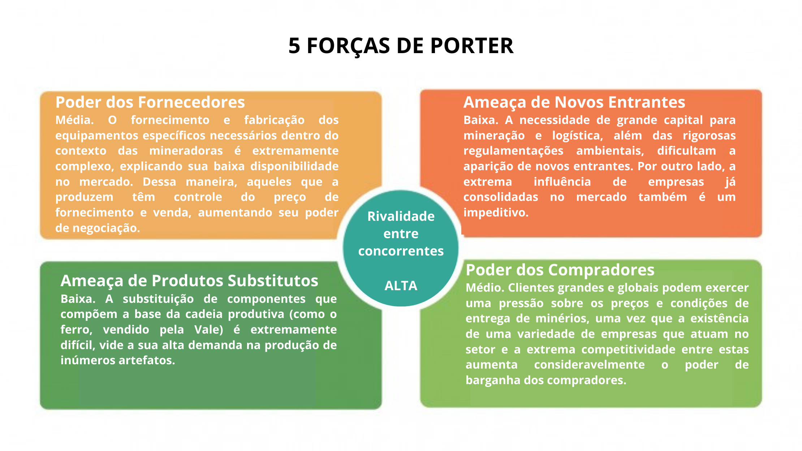
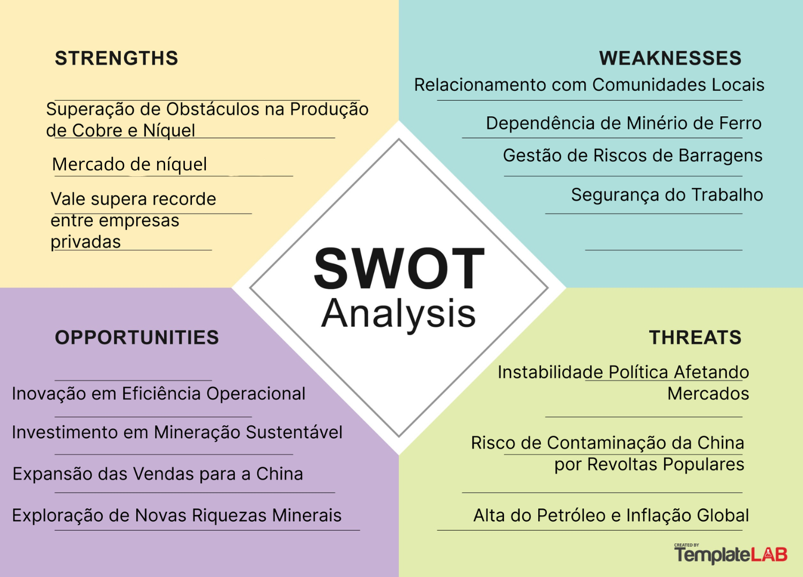
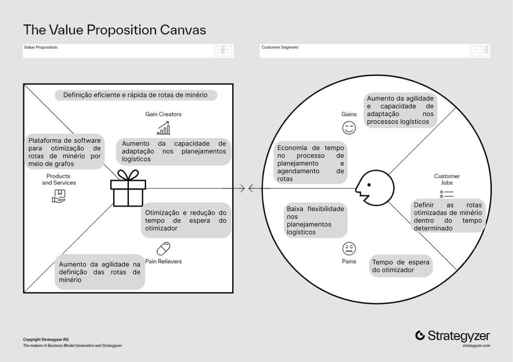

# Entendimento de negócio

&emsp;&emsp;A compreensão do negócio e seu contexto é crucial para o desenvolvimento de soluções eficazes. Esta análise detalhada visa proporcionar uma visão ampla e aprofundada sobre a indústria, o parceiro e o produto em questão. Ao discutir sobre os diferentes aspectos do cenário competitivo, busca-se não apenas identificar oportunidades e desafios, mas também moldar uma solução que se destaca no mercado.

## 1 - Contexto da Indústria do Parceiro

&emsp;&emsp;O contexto da indústria do parceiro, no caso da mineração de minério de ferro, está atualmente marcado por uma série de tendências significativas, competições acirradas e modelos de negócio em evolução, influenciados fortemente por fatores externos, como a demanda por minerais críticos e a urgência de práticas sustentáveis. Como é mencionado no artigo da Deloitte, as tendências de mineração de 2023 destacam a crescente importância da sustentabilidade e da inovação tecnológica no setor1. 

### 1.1 - Principais Competidores

&emsp;&emsp;A indústria de minério de ferro é dominada por grandes empresas globais, como Vale, Rio Tinto e BHP. Essas empresas lideram a produção e distribuição mundial de minério de ferro, enfrentando a concorrência tanto em escala global quanto local. 

&emsp;&emsp;Além disso, a entrada de novos players, particularmente governos e fundos públicos, está redefinindo o cenário competitivo. Governos ao redor do mundo estão formando alianças, instituindo políticas e mobilizando recursos para assegurar acesso a minerais críticos, impactando diretamente a indústria de mineração. Este cenário competitivo é evidenciado por análises como as da PwC, que ressaltam a dinâmica de competição e cooperação no setor2.

&emsp;&emsp;A Vale S.A. mantém sua posição como um dos líderes globais no setor de mineração, particularmente em minério de ferro e níquel, competindo diretamente com gigantes como BHP, Rio Tinto, Anglo American, e Fortescue Metals Group. Este ambiente competitivo é definido por fatores como preço, qualidade do produto, confiabilidade, e eficiência logística. Dessa forma, a qualidade superior do minério da Vale, com baixos níveis de impureza, oferece uma vantagem significativa, reduzindo custos de processamento para siderúrgicas e melhorando a eficiência operacional.

### 1.2 - Modelos de Negócio

&emsp;&emsp;Os modelos de negócio na mineração de minério de ferro estão se adaptando a um ambiente cada vez mais digitalizado e focado na sustentabilidade. A descarbonização da cadeia de valor e a inovação tecnológica são fundamentais para reduzir os custos, perigos e impactos ambientais associados com a mineração. Empresas estão formando parcerias estratégicas não apenas dentro da indústria, mas também com setores relacionados a etapas após extração, para desenvolver tecnologias limpas e melhorar a eficiência energética. A EY destaca em seu relatório sobre riscos e oportunidades em mineração e metais no Brasil a importância crescente da ESG (Environmental, Social, and Governance) nas estratégias das empresas do
setor.

&emsp;&emsp;Nesse mesmo âmbito, é importante mencionar que a indústria enfrenta uma transformação significativa, impulsionada pela demanda por minerais críticos e um compromisso global com a mineração sustentável. A descarbonização e a inovação tecnológica são essenciais para minimizar impactos ambientais e aumentar a eficiência. A Vale lidera com práticas sustentáveis, atendendo as exigências do mercado e com responsabilidade ambiental. Além disso, alguns governos emergem como novos atores, estabelecendo políticas para assegurar minerais críticos, colocando a Vale em posição favorável para se adaptar as mudanças, com foco em energias renováveis e tecnologias limpas.

### 1.3 - Tendências de Mercado

&emsp;&emsp;As tendências de mercado atuais destacam a importância da sustentabilidade e da inovação tecnológica. Empresas líderes estão focando na descarbonização e na eficiência energética para minimizar impactos ambientais e melhorar a competitividade. Há também um aumento na demanda por minerais críticos, essenciais para tecnologias limpas e energias renováveis, impulsionando mudanças nos modelos de negócio e estratégias de mineração.

&emsp;&emsp;A pressão para reduzir as emissões de carbono e adotar práticas sustentáveis é uma das maiores tendências. Iniciativas para diminuir as emissões de gases de efeito estufa em todas as fases da cadeia de valor, desde a mineração até o transporte marítimo e a produção de aço, são fundamentais. A busca por "metais verdes" e financiamentos vinculados a critérios de sustentabilidade também está se tornando comum, conforme destacado no estudo da Deloitte3 sobre as tendências de mineração.

&emsp;&emsp;Além disso, é importante mencionar que a inovação tecnológica é essencial para enfrentar os desafios de mineração em depósitos cada vez mais profundos e para operações mais eficientes e sustentáveis. A digitalização das minas, a utilização de gêmeos digitais e o avanço de tecnologias autônomas estão entre as principais inovações adotadas pelo setor.

#### 1.4 Conclusão 
&emsp;&emsp;Portanto, a Vale S.A. continua a ser um ator influente no setor global de mineração, enfrentando desafios e capitalizando sobre oportunidades em um mercado em rápida evolução. Sua abordagem estratégica, com foco em inovação e compromisso com a sustentabilidade a posicionam para liderar na transição para uma economia de baixo carbono e atender à crescente demanda por tecnologias limpas e energias renováveis. 

&emsp;&emsp;As tendências atuais do mercado, incluindo a descarbonização, a digitalização e a demanda por minerais críticos, destacam a importância de adaptabilidade e inovação contínuas para manter a competitividade e promover o desenvolvimento sustentável.

### 1.5 - 5 Forças de Porter

&emsp;&emsp;As 5 Forças de Porter são um framework de análise setorial que pretende compreender as forças competitivas que permeiam um mercado pré-existente. A partir disto, apresentam-se os principais atores envolvidos, sendo estes: Concorrentes, Fornecedores, Compradores, Entrantes e Substitutos. Por conseguinte, entende-se como os diferentes atuantes se relacionam e influenciam determinado setor.

&emsp;&emsp;Na avaliação abaixo, foi considerado para análise o setor da Mineração.

  
<b>Figura 1 </b>- 5 Forças de Porter 

  
  
Fonte: elaborado por MiNet

&emsp;&emsp;Abaixo, segue uma explicação das métricas utilizadas acima:

#### 1.5.1 Ameaça de Novos Entrantes:

&emsp;&emsp;A probabilidade de entrada de novos players significativos é baixa, em decorrência da necessidade de grande investimento de capital para a atividade de mineração e logística. Isto, corroborando com as rigorosas regulamentações ambientais, amplifica a dificuldade de aparição de novos entrantes. 

&emsp;&emsp;Por outro lado, a influência de governos locais interessados na instauração de novos projetos de mineração é um dos grandes motivos para a expansão de players já existentes e o surgimento de outros financiados estatalmente, como ocorreu com o Governo de Guiné, através de Simandou e vêm ocorrendo na China, progressivamente, após a descoberta de jazidas minerais no interior do país.  Este investimento público atrai novas empresas a entrarem neste mercado, mas não ocorre de maneira tão congruente a ponto de afirmar que esta estimativa aumenta, substancialmente, a possibilidade de novos entrantes.

#### 1.5.2 Poder dos Compradores:

&emsp;&emsp;Partindo do pressuposto de que os principais clientes do ramo da mineração são grandes grupos siderúrgicos mundiais, estes têm poder suficiente de barganha para discutir o preço dos minerais vendidos e, consequentemente, dificultar a negociação de preços. De maneira síncrona, estes têm capacidade de exercer pressão sobre a qualidade dos minérios entregues.

&emsp;&emsp;Isto, em congruência com a enorme rivalidade entre concorrentes e a competição que exercem neste conceito de indústria, configura o Poder dos Compradores como média. 

#### 1.5.3 Ameaça de Produtos Substitutos:

&emsp;&emsp;A chance de entrada de novos produtos que possam substituir os derivados deste setor do mercado não configura uma real ameaça, sendo, então, baixa. A substituição de componentes que compõem a base da cadeia produtiva (como o ferro, vendido pela Vale) é extremamente complexa, vide a sua alta demanda na produção de inúmeros artefatos nas mais variadas áreas da indústria, sendo essenciais para a construção de ferramentas, veículos e maquinário industrial, por exemplo.

#### 1.5.4 Poder dos Fornecedores:

&emsp;&emsp;O Poder de Barganha dos Fornecedores para esta área da indústria é média. Isto se dá em decorrência da dificuldade de fornecimento e fabricação dos equipamentos específicos necessários dentro do contexto das mineradoras. Em outra questão, o contrato com equipes de manutenção e construção das redes de distribuição ferroviárias é uma demanda insubstituível para o ramo, sendo prioritária para o escoamento dos minerais. 

&emsp;&emsp;Finalmente, não estão disponíveis no mercado inúmeras opções de fornecimento. Esta afirmação, acoplada à extrema necessidade deste tipo de serviço para o modelo de trabalho pressuposto para este mercado, permite que aqueles que a produzem tenham controle do preço de fornecimento e venda, aumentando seu poder de negociação.

#### 1.5.5 Rivalidade entre Concorrentes:

&emsp;&emsp;A rivalidade entre concorrentes é, a priori, alta, já que, apesar do baixo potencial de entrada de novos players no mercado, os atuais concorrentes disputam entre si pelos mercados já existentes, em especial pela indústria Chinesa. Isso está evidenciado pelo investimento contínuo de empresas do ramo em expandir seus pontos de distribuição com o intuito de reduzir custos operacionais e acessar novas áreas, como a Vale, empresa brasileira que pretende instaurar um novo hub na Europa, possibilitando a entrada neste mercado e facilitando o trânsito de mercadorias com a China. Da mesma maneira, a expansão agressiva da Rio Tinto (empresa anglo-australiana do ramo) com a instauração da mina em Simandou marca um risco à liderança da BHP (outra instituição anglo-australiana) como a empresa de Ferro mais valiosa do mundo, fazendo-o pela assunção de uma nova mina e de um novo mercado. 

&emsp;&emsp;Assim, pode-se imaginar que a constante disputa por mercados consumidores amplifica a rivalidade entre as principais empresas deste setor, caracterizando-a como alta.

## 2 - Análise SWOT do Parceiro

&emsp;&emsp;A análise SWOT é uma ferramenta estratégica essencial para compreender o ambiente competitivo em que uma empresa está inserida, guiando-a na tomada de decisões mais assertivas e no delineamento de suas estratégias. Conforme citado pela instituição UFABC Jr., ela "é uma ferramenta voltada à análise de cenários para decisões, levando em conta fatores internos e externos que podem influenciar positiva ou negativamente o futuro de um negócio"4.

&emsp;&emsp;No desenvolvimento do projeto MiNet, empregou-se a análise SWOT como ferramenta de planejamento estratégico, mapeando as forças, fraquezas, oportunidades e ameaças para fornecer uma base sólida na formulação de decisões informadas e eficientes durante todo o processo do projeto. A imagem a seguir ilustra a análise SWOT:

  
<b>Figura 2 </b>- Swot 

  
  
Fonte: elaborado por MiNet

#### 2.1 Strenghts:

- Superação de Obstáculos na Produção de Cobre e Níquel: A habilidade da Vale em superar desafios operacionais no setor de cobre e níquel reforça sua posição como uma empresa resiliente e adaptável a condições adversas, garantindo a continuidade da produção em setores vitais para a economia global5.

- Mercado de níquel: Uma força atual da Vale é sua posição significativa no mercado de níquel, que é um componente chave em baterias, especialmente com a crescente demanda por veículos elétricos e sistemas de armazenamento de energia. Como uma das maiores fornecedoras de níquel, a Vale está bem posicionada para se beneficiar desse aumento de demanda, o que representa uma forte vantagem competitiva no mercado atual.​6​.
- Vale Supera Entre Empresas Privadas: O destaque da Vale entre as empresas privadas reflete sua competência em otimizar recursos, inovar em suas práticas operacionais e sua habilidade em se destacar em um mercado competitivo7.
- Produção de minério de ferro: A Vale se destaca no mercado global de mineração e metais devido ao seu ponto forte na produção de pelotas de ferro. Essa expertise é essencial para a cadeia produtiva do aço, onde as pelotas desempenham um papel fundamental. A Vale destacou-se no mercado de mineração e metais, especialmente na produção de pelotas de ferro. Em 2023, a empresa produziu 321,15 milhões de toneladas de minério de ferro, representando um aumento de 4,3% em relação ao ano anterior, e a produção de pelotas foi de 9,9 milhões de toneladas no quarto trimestre de 2023, um aumento de 19% em comparação ao ano anterior.20.Esse diferencial na produção de pelotas de ferro reforça a posição da Vale como líder no setor, contribuindo significativamente para o desenvolvimento econômico e social, além de agregar valor aos seus clientes e parceiros comerciais.

#### 2.2 Weaknesses: 

- Gestão de Riscos de Barragens: Os eventos trágicos de Brumadinho e Mariana destacaram deficiências críticas na gestão de riscos associados às barragens, apontando a necessidade de melhorias substanciais nessa área8.

- Relacionamento com Comunidades Locais: A construção e manutenção de um relacionamento saudável e positivo com as comunidades locais onde opera é um desafio constante para a empresa9.

- Dependência de minério de Ferro: A forte dependência do minério de ferro como principal produto da Vale coloca a empresa em uma posição vulnerável a variações de demanda e preço desse mercado específico10.

- Segurança dos trabalhadores:A segurança dos trabalhadores na Vale, enfatizada após os desastres de Mariana e Brumadinho, permanece uma prioridade essencial. A empresa enfrenta o desafio de intensificar as medidas de segurança para proteger seus empregados, minimizando riscos e assegurando práticas seguras de trabalho em suas operações de mineração11.

#### 2.3 Opportunities:

- Inovação em Eficiência Operacional: A Vale tem a oportunidade de liderar o setor com inovações que aumentem a eficiência operacional, reduzindo custos e otimizando processos12.

- Investimento em Mineração Sustentável: Investir em práticas de mineração sustentável pode abrir portas para novos mercados e melhorar a reputação corporativa da Vale, alinhando a empresa com as crescentes demandas por responsabilidade ambiental13.

- Expansão das Vendas para a China: O potencial de crescimento das vendas para a China representa uma grande oportunidade para a Vale, especialmente em um momento em que o país busca diversificar suas fontes de minério14.

- Exploração de Novas Riquezas Minerais: A Vale pode explorar novas riquezas minerais, aproveitando as vastas reservas inexploradas e expandindo sua carteira de produtos.

#### 2.4 Threats:

- Instabilidade Política Afetando Mercados: A instabilidade política pode impactar significativamente a economia. Ela afeta a variável mais dinâmica de uma economia que é o investimento, que, por sua vez, é o que gera efetivamente crescimento econômico e produtividade. Além disso, a instabilidade política e econômica pode afetar os investimentos, estimulando alterações nas taxas de juros e afetando o preço de commodities. A instabilidade política também pode levar à incerteza e à imprevisibilidade na elaboração de políticas públicas, o que pode ter efeitos negativos na economia15.

 - Risco de Contaminação da China por Revoltas Populares: A China tem enfrentado vários desafios ambientais, incluindo a poluição do ar. Em resposta a isso, o país implementou um Plano de Ação Nacional da Qualidade do Ar para reduzir a poluição em um período de quatro anos. No entanto, a contaminação por chumbo tem provocado protestos na China, alimentando revoltas em uma sociedade cada vez mais crítica à gestão governamental. Além disso, uma série de protestos locais foram desencadeados no país por uma série de questões16.

- Alta do Petróleo e Inflação Global: A alta do preço do petróleo é um dos fatores que alimentam os temores de persistência da inflação global. A alta dos preços do petróleo tem impacto na inflação e a discussão busca compreender a magnitude deste impacto. A alta do preço do petróleo, neste ambiente, será um elemento adicional desestabilizador e colocará mais dúvidas sobre a capacidade dos bancos centrais manterem as expectativas de inflação controladas17.

&emsp;&emsp;Em síntese, a utilização da Matriz SWOT no projeto MiNet destaca a relevância de conduzir uma avaliação estratégica detalhada. Tal análise é vital para garantir a tomada de decisões sólidas e aprimorar a eficácia do projeto. Por meio dessa metodologia, torna-se viável compreender com precisão o ambiente no qual a organização opera, bem como definir uma estratégia clara para superar obstáculos iminentes e maximizar as vantagens competitivas.

## 3 - Descrição da Solução a Ser Desenvolvida

### 3.1 - Problema a Ser Resolvido

&emsp;&emsp;O desafio central do projeto está na otimização da malha logística para a distribuição de minério de ferro da Vale, enfrentando a complexidade de sincronizar diversos modais de transporte com variadas capacidades e tempos de espera, ao mesmo tempo em que se atende as especificações de qualidade dos clientes. 

&emsp;&emsp;A complexidade está relacionada com a necessidade de equilibrar a oferta de diferentes minas com a demanda global, mantendo a eficiência operacional em um ambiente de constantes mudanças de mercado. Este problema nos faz tentar superar as limitações operacionais e estratégicas, visando gerar uma cadeia de suprimentos mais responsiva.

### 3.2 - Solução Proposta (Visão de Negócios)

&emsp;&emsp;A solução proposta envolve o desenvolvimento de uma plataforma de otimização e um software avançado, ambos baseados em modelagem de grafos e algoritmos de otimização. Essa abordagem  visa transformar o planejamento logístico da Vale, permitindo uma visão da cadeia de suprimentos e facilitando o alinhamento estratégico com as metas de negócio. Um site que demonstra a resolução do problema do fluxo máximo da Vale por meio de uma aplicação web em Java, oferecendo uma interface e um frontend intuitivos para que os clientes possam adaptar suas mudanças e preferências, garantindo assim uma maior usabilidade.

&emsp;&emsp;Além de maximizar a eficiência logística, a solução busca promover uma gestão mais ágil e adaptável, capaz de responder dinamicamente as variações de demanda e condições operacionais, reforçando assim a competitividade e a liderança de mercado da Vale.

### 3.3 - Como a Solução Proposta Deverá Ser Utilizada

&emsp;&emsp;A aplicação prática da plataforma e do software propostos será por meio da utilização contínua pelos planejadores de Supply Chain, que vão inserir dados dinâmicos sobre produção, demanda e capacidade logística. A tecnologia empregada permitirá a planejamento de diferentes cenários de planejamento, fornecendo recomendações estratégicas para a otimização dos fluxos de distribuição. 

&emsp;&emsp;Este processo não apenas facilitará a tomada de decisão baseada em dados, mas também irá promover uma cultura de melhoria contínua e inovação dentro da organização, potencializando a eficácia logística e a satisfação do cliente.

### 3.4 - Benefícios Trazidos pela Solução Proposta

&emsp;&emsp;Implementar essa solução trará diversos benefícios, incluindo a redução significativa dos custos logísticos e a melhoria da eficiência operacional. A capacidade de atender de forma mais precisa e rápida as demandas do mercado não apenas irá reforçar a reputação da Vale como líder em seu setor, mas também vai contribuir para uma maior sustentabilidade ambiental. 

&emsp;&emsp;A otimização da cadeia de suprimentos irá permitir uma melhor utilização dos recursos, minimizando desperdícios e impactos ambientais, alinhando a operação logística com os objetivos de sustentabilidade corporativa.

### 3.5 - Critério de Sucesso e Medida para Avaliação

&emsp;&emsp;Será principalmente julgado pela plataforma de fácil usabilidade e universal para a empresa, que também apresenta um algoritmo altamente eficiente, preciso e rápido, garantindo assim tanto a usabilidade quanto a portabilidade. Por isso, o  sucesso da solução pode ser medido por um conjunto de indicadores chave de desempenho (KPIs), incluindo a redução nos custos logísticos, a melhoria no nível de serviço ao cliente (medido pela precisão e tempo de entrega), e a diminuição da pegada de carbono da operação logística. 

&emsp;&emsp;Ademais, a capacidade de adaptação rápida a mudanças no mercado e a melhoria na tomada de decisão estratégica serão indicadores qualitativos do valor agregado pela solução. A avaliação contínua desses indicadores permitirá à Vale monitorar o progresso em direção aos seus objetivos estratégicos, assegurando que a solução não apenas atenda, mas consiga exceder as expectativas de eficiência, sustentabilidade e competitividade no mercado global. 

&emsp;&emsp;Adicionalmente, é crucial avaliar o tempo de execução do algoritmo para garantir que a solução seja não apenas precisa, mas também rápida e eficiente. O tempo de execução será comparado com o sistema atual para estabelecer benchmarks de desempenho. Essa comparação ajudará a identificar melhorias significativas na velocidade e na eficiência operacional, contribuindo para uma otimização contínua do processo logístico.

 &emsp;&emsp;Além disso, a capacidade de adaptação rápida a mudanças no mercado e a melhoria na tomada de decisão estratégica serão indicadores qualitativos do valor agregado pela solução. A avaliação contínua desses indicadores permitirá à empresa monitorar o progresso em direção aos seus objetivos estratégicos, assegurando que a solução não apenas atenda, mas consiga exceder as expectativas de eficiência, sustentabilidade e competitividade no mercado global.

&emsp;&emsp;E for fim, para uma medição efetiva do sucesso, as métricas específicas vão incluir a modelagem matemática do problema, abordando as variáveis de decisão, a função objetivo e as restrições, juntamente com a implementação de algoritmos de redes de fluxo. Esses algoritmos serão aplicados na obtenção das soluções, garantindo uma abordagem sistemática e quantificável para a avaliação do sucesso da solução proposta.

## 4 - Matriz de Riscos 

&emsp;&emsp;A matriz de risco18é uma forma dinâmica de conseguir analisar quais são os riscos que cercam uma empresa ou projeto. É importante para conseguir gerir e prever potenciais riscos, podendo eles serem vistos como ameaça, que causa impacto negativo, ou como uma oportunidade, que causa impacto positivo. Essa dupla visão é necessária para se preparar mediante qualquer situação, tanto as positivas quanto as negativas. No entanto, se não existir um plano de ação para esses riscos, as oportunidades podem ser perdidas e as ameaças podem causar impactos maiores. Por isso, junto da matriz de risco é feito o plano de ação para cada possibilidade.

&emsp;&emsp; Assim, compreender profundamente cada risco permite ao Minet elaborar estratégias preventivas e reativas precisas, garantindo que tanto as ameaças quanto as oportunidades sejam abordadas com a devida atenção. Nesse sentido, a matriz não é apenas uma ferramenta de visualização, mas também um guia para a ação proativa, fomentando uma cultura de vigilância e adaptabilidade, a qual é vital no ambiente dinâmicoo da Vale. e por meio dessa análise contínua, o projeto se fortalece, antecipando cenários e reforçando a robustez da solução proposta frente aos desafios e incertezas do setor de mineração.

&emsp;&emsp;Veja a seguir a matriz do projeto MiNet:

  
<b>Figura 4 </b>- Matriz de Risco 

  
  
Fonte: elaborado por MiNet

&emsp;&emsp; A partir da matriz de risco apresentada, é possível pensar em soluções para cada risco. Veja a seguir a transcrição dos riscos e o plano de ação para cada um.

### 4.1 **Ameaças**

  
<b>Quadro 1 </b>- Ameaças 

| Ameaça             | Descrição                                                                                         | Plano de Ação                                                                                              |
|--------------------|---------------------------------------------------------------------------------------------------|-----------------------------------------------------------------------------------------------------------|
| **Risco 01**       | O modelo não refletir a realidade                                                                | Verificar continuamente e alinhar com a Vale para validar o modelo.                                        |
| **Risco 02**       | Não aplicar os conceitos de grafos corretamente                                                  | Treinamento adicional e revisão constante das aplicações no modelo.                                        |
| **Risco 03**       | Não considerar alguma restrição (dentro do escopo dado)                                          | Comunicação efetiva e constante com a Vale para documentar todas as restrições.                            |
| **Risco 04**       | Erro de direcionamento de escopo                                                                 | Realizar workshops regulares com a Vale para um entendimento mútuo do escopo.                              |
| **Risco 05**       | O modelo não ser usado corretamente                                                              | Disponibilizar instruções detalhadas e treinamento para os usuários finais.                                |
| **Risco 06**       | Troca de escopo faltando pouco tempo                                                             | Definir claramente o escopo no início e restringir mudanças ao longo do projeto.                           |
| **Risco 07**       | Mudança na cadeia de fornecimento durante o projeto                                              | Atualizar o modelo com agilidade para incorporar novos dados, se viável.                                   |
| **Risco 08**       | Não compreender o problema em sua totalidade                                                     | Aprofundar o estudo da indústria mineradora e dos conceitos de modelagem e grafos.                         |
| **Risco 09**       | Falta de presença de membros do grupo                                                            | Definir um cronograma claro e comunicar ausências com antecedência.                                        |
| **Risco 10**       | Rotas com especificidades não mapeadas                                                           | Documentar e incluir todas as especificações conhecidas no modelo.                                         |
| **Risco 11**       | Falhas técnicas nos computadores dos membros                                                     | Implementar uma estratégia de backup dos dados e planos alternativos de hardware.                          |
| **Risco 15**       | Interrupção do acesso à infraestrutura de TI                                                     | Desenvolver um plano de recuperação de desastres e contingência de TI.                                     |
| **Risco 16**       | Retenção insuficiente de conhecimento técnico após o projeto                                     | Criar documentação detalhada e transferência de conhecimento para a Vale.                                  |
| **Risco 17**       | Dificuldades na integração do sistema com as ferramentas existentes                              | Planejar integração sistemática e realizar testes de compatibilidade com antecedência.                     |

  
Fonte: Elaborada pelo MiNet

### 4.2 **Oportunidades**

  
<b>Quadro 2 </b>- Oportunidades 

| Oportunidade       | Descrição                                                                                         | Plano de Ação                                                                                              |
|--------------------|---------------------------------------------------------------------------------------------------|-----------------------------------------------------------------------------------------------------------|
| **Risco 12**       | Receber dados sobre os custos operacionais                                                        | Expandir o modelo para incluir dados operacionais e oferecer uma visão mais completa.                      |
| **Risco 13**       | Visitas que permitam um melhor entendimento do contexto do projeto                                | Organizar visitas aos sites da Vale para insights diretos e melhoria do modelo.                            |
| **Risco 14**       | Entregar o projeto com funcionamento na nuvem                                                     | Desenvolver uma solução baseada na nuvem para acessibilidade e teste remoto.                               |
| **Risco 18**       | Adaptação rápida às mudanças regulatórias                                                         | Manter atualização constante sobre regulamentações e adaptar o projeto conforme necessário.                |
| **Risco 19**       | Expansão para novos mercados e setores                                                            | Explorar oportunidades para adaptar e aplicar a solução em outros contextos além da Vale.                  |
| **Risco 20**       | Reconhecimento como líderes em inovação em otimização de rotas de minério                         | Utilizar o sucesso do projeto para destacar o Minet como referência em inovação logística.               |

  
Fonte: Elaborada pelo MiNet

### 4.3 Conclusão

&emsp;&emsp;A matriz de risco atualizada é um elemento vital para a gestão de projetos, oferecendo uma abordagem estruturada e proativa para enfrentar desafios e capturar oportunidades. Com o detalhamento dos planos de ação, o Minet posiciona-se para enfrentar os desafios do ambiente de mineração e entregar uma solução robusta e bem-sucedida para a Vale. A flexibilidade e iteratividade da matriz de risco asseguram que a equipe do Minet possa responder rapidamente a qualquer situação, maximizando o sucesso do projeto e mitigando possíveis contratempos.

&emsp;&emsp;Dessa forma,  os riscos adicionados refletem não apenas as preocupações imediatas, mas também as projeções de longo prazo. Assim, a atenção minuciosa a esses riscos e a elaboração de planos de ação adequados se traduz em uma capacidade robusta de adaptação e crescimento contínuo, permitindo que a equipe antecipe problemas e capitalize em oportunidades emergentes.

 &emsp;&emsp;A aplicação e a revisão contínua da matriz de riscos, com seu acompanhamento de planos de ação correspondentes, reforçam a posição do Minet não apenas como um projeto de otimização de rotas, mas como um padrão de referência em gerenciamento de riscos dentro da indústria mineradora. Este aspecto é fundamental para a construção de confiança e credibilidade junto com a Vale e stakeholders relevantes, estabelecendo um marco para futuros empreendimentos que buscam alinhar inovação tecnológica com a solidez operacional e estratégica. O projeto, portanto, não apenas atende as necessidades atuais, mas deixa o caminho pra uma jornada de inovação sustentável e adaptativa no horizonte da indústria de mineração.
 
## 5 - Value Proposition Canvas

&emsp;&emsp;O Tera Blog define o Value proposition canvas, ou canvas de proposta de valor, como "uma ferramenta de análise de público consumidor, que ajuda a entender dores, necessidades e desejos. Essa metodologia baseia a tomada de decisões nos mais diversos níveis e também dá suporte a lançamentos19". Assim, o Value Proposition Canvas surge como um aliado "estratégico" no projeto, facilitando a compreensão das necessidades específicas da Vale e permitindo o desenvolvimento de uma oferta com suas exigências mais imediatas. A utilização desta ferramenta viabilizou uma imersão nas complexidades operacionais, permitindo que fosse desenhada uma proposta de valor que não apenas soluciona desafios imediatos, mas também se adapta e evolui em relação com as expectativas futuras da empresa.

&emsp;&emsp;Ao focar em dores críticas como os períodos de espera do otimizador e a rigidez nos planejamentos, o projeto "redefine" o padrão para a gestão logística, fomentando uma cultura de melhoria constante e de adaptação dos processos logísticos. Neste sentido, a estratégia delineada pelo Canvas de Proposta de Valor não se restringe a solucionar questões operacionais do presente, mas procura antecipar as tendências e desafios futuros. Ao fazer isso, a Vale é preparada  para as novas etapas da sua jornada logística, garantindo a manutenção da liderança no setor por meio da eficiência operacional , reafirmando o compromisso com a evolução e o sucesso a longo prazo.

&emsp;&emsp;A imagem abaixo (Figura 5) apresenta o Canvas de Proposta de Valor elaborado como uma ferramenta visual que sintetiza a análise realizada sobre as expectativas e necessidades da Vale. Este canvas detalha como a oferta do Minet se alinha aos requisitos do cliente, mapeando diretamente as dores e ganhos, as tarefas a serem cumpridas e os alívios que a solução proporcionará. É posível observar a distribuição estratégica das áreas de foco, onde a definição eficiente e rápida das rotas de minério, a economia de tempo no planejamento e o incremento da capacidade de adaptação aos processos logísticos se destacam como elementos chave. Este diagrama é o resultado de um estudo cuidadoso das dinâmicas operacionais e estratégicas da Vale, refletindo o compromisso do grupo em entregar uma solução que não apenas atenda as exigências atuais, mas que também seja escalável e sustentável a longo prazo.

<b>Figura 5 </b>- Canvas Value Proposition 

    

Fonte: Elaborado por MiNet

Analisando o Value Proposition Canvas do Minet, pode-se aprofundar e detalhar cada um dos elementos apresentados para refletir a aliança estratégica da solução com as operações da Vale:

**Tarefas:** 
- Desenvolver algoritmos avançados para a definição de rotas de minério que otimizem a utilização dos recursos e reduzam os tempos de entrega.
- Assegurar a definição de rotas otimizadas de minério que cumpram com os prazos estipulados, mantendo a qualidade e a eficiência logística.

**Dores:** 
- Redução significativa no tempo de espera inerente ao otimizador atual, um obstáculo reconhecido para a produtividade.
- Flexibilização dos processos de planejamento logístico para acomodar ajustes rápidos e eficientes em resposta a mudanças operacionais ou de mercado.

**Ganhos:**
- Maximização da economia de tempo no ciclo de planejamento e agendamento, resultando em um fluxo de trabalho mais eficiente.
- Aprimoramento da agilidade e da capacidade de adaptação da Vale em seus processos logísticos, promovendo uma gestão mais resiliente e responsiva.

**Alívio das dores:**
- Implementação de otimizações no software para minimizar os períodos de espera, proporcionando um sistema mais reativo e dinâmico.
- Incremento da velocidade e da precisão na definição de rotas de minério, adaptando-se rapidamente às exigências operacionais.

**Criadores de ganhos:**
- Garantia de definição eficiente e expedita das rotas de minério, com a integração de análises de dados em tempo real e modelagem preditiva.
- Facilitação da adaptação e do ajuste fino nos planejamentos logísticos, permitindo uma resposta ágil diante de demandas flutuantes.

**Produtos e Serviços:**
- Disponibilização de uma plataforma de software robusta que emprega modelagem de grafos para a otimização de rotas, com interface intuitiva e relatórios detalhados que suportam a tomada de decisão estratégica. 

&emsp;&emsp;A partir do Canvas podemos definir a proposta de valor da solução como sendo, "O Minet oferece um software de otimização de rotas de minério por meio de grafos, o que ajuda o Gerente de logística da Vale a alcançar a definição eficiente e rápida das rotas de minério. Proporcionamos o aumento da capacidade de adaptação nos planejamentos logísticos".

&emsp;&emsp;Na conclusão do projeto, é crucial ressaltar a relevância do Canvas de Proposta de Valor na definição precisa da proposta do Minet para a Vale. Este método permitiu uma compreensão profunda das necessidades e desafios enfrentados pela empresa, resultando em uma solução que aborda diretamente essas questões.

&emsp;&emsp;Ao destacar o software de otimização de rotas de minério oferecido pelo Minet, é essencial enfatizar como essa solução atende às dores específicas da Vale, como o tempo de espera do otimizador e a inflexibilidade nos planejamentos logísticos. Além disso, é fundamental ressaltar os ganhos proporcionados, como a economia de tempo no processo de planejamento e agendamento de rotas, juntamente com o aumento da agilidade e capacidade de adaptação nos processos logísticos.

&emsp;&emsp;A proposta de valor claramente definida do Minet demonstra o valor tangível que a solução oferece à Vale, ao proporcionar uma definição eficiente e rápida das rotas de minério e uma maior capacidade de adaptação nos planejamentos logísticos. Isso não apenas destaca a eficácia da solução proposta, mas também reforça a importância de uma compreensão profunda das necessidades do cliente na criação de uma oferta verdadeiramente impactante.

&emsp;&emsp;Portanto, conclui-se que o Canvas de Proposta de Valor foi fundamental para moldar o direcionamento estratégico do projeto, garantindo que a solução desenvolvida pelo Minet esteja alinhada às necessidades e expectativas da Vale, resultando em benefícios tangíveis e mensuráveis para a empresa.

### Referências
1. As tendências de Mineração 2023 | Deloitte Brasil. Disponível em: <https://www2.deloitte.com/br/pt/pages/energy-and-resources/articles/tendencias-mineracao.html>. Acesso em: 15 fev. 2024.
2. PRICEWATERHOUSECOOPERS. Mineração 2023. Disponível em: <https://www.pwc.com.br/pt/estudos/setores-atividade/mineracao-e-siderurgia/2023/mineracao-2023.html>. Acesso em: 15 fev. 2024.
3. As tendências de Mineração 2023 | Deloitte Brasil. Disponível em: <https://www2.deloitte.com/br/pt/pages/energy-and-resources/articles/tendencias-mineracao.html>. Acesso em: 15 fev. 2024.
4. Análise SWOT: o que é + 4 passos de como fazer do zero! Disponível em: <https://ufabcjr.com.br/metodologia-agil-analise-swot-2/>. Acesso em: 15 fev. 2024.
5. Vale atualiza prazos de projeções sobre produção de cobre e níquel. Disponível em: <https://br.advfn.com/jornal/2022/09/vale-atualiza-prazos-de-projecoes-sobre-producao-de-cobre-e-niquel>. Acesso em: 15 fev. 2024. 
6. Vale Q4 2010 net profit up four times to $5.9 billion. Disponível em: <https://pitchgrade.com/companies/vale.> Acesso em: 15 fev. 2024.
7. Vale tem maior lucro entre empresas privadas da história do país, aponta Economática. Disponível em: <https://oglobo.globo.com/economia/vale-tem-maior-lucro-entre-empresas-privadas-da-historia-do-pais-aponta-economatica-2817812>. Acesso em: 15 fev. 2024. 
8. Tragédia de Mariana pode ter novo acordo inspirado no de Brumadinho. Disponível em: <https://agenciabrasil.ebc.com.br/geral/noticia/2021-08/tragedia-de-mariana-pode-ter-novo-acordo-inspirado-no-de-brumadinho>. Acesso em: 15 fev. 2024. 
9. BARTABURU, X. Trilhos da maior mina de ferro do mundo impactam a vida de comunidades pobres no Maranhão. Disponível em: <https://brasil.mongabay.com/2022/06/trilhos-da-maior-mina-de-ferro-do-mundo-impactam-a-vida-de-comunidades-pobres-no-maranhao/>. Acesso em: 15 fev. 2024. 
10. Estratégia da Vale é diminuir cada vez mais a dependência do minério de ferro. Disponível em: <https://ibram.org.br/noticia/estrategia-da-vale-e-diminuir-cada-vez-mais-a-dependencia-do-minerio-de-ferro/>. Acesso em: 15 fev. 2024. 
11. Histórico de violações da Vale vai muito além de Mariana e Brumadinho. Disponível em: <https://www.brasildefato.com.br/2019/01/29/historico-de-violacoes-da-vale-vai-muito-alem-de-mariana-e-brumadinho>.
12. DESKGRAPHICS. Eficiência operacional e inovação nunca andaram tão juntos. Descubra o porquê agora. Disponível em: <https://blog.deskgraphics.com.br/eficiencia-operacional-e-inovacao-nunca-andaram-tao-juntos-descubra-o-porque-agora/>. Acesso em: 15 fev. 2024. 
13. GUERRA, B. Mineração sustentável: algo possível ou incoerente? Disponível em: <https://meiosustentavel.com.br/mineracao-sustentavel/>. Acesso em: 15 fev. 2024.
14. China lidera e-commerce global em 2023 com vendas na casa de US$ 2,2 trilhões. Disponível em: <https://www.ecommercebrasil.com.br/noticias/china-lidera-e-commerce-global-em-2023-com-vendas-na-casa-de-us-22-trilhoes>. Acesso em: 15 fev. 2024. 
15. BERWANGER, T. Como a instabilidade política e econômica afeta seus investimentos? Disponível em: <https://procave.com.br/como-a-instabilidade-politica-e-economica-afeta-seus-investimentos/>. Acesso em: 15 fev. 2024. 
16. Histórico de violações da Vale vai muito além de Mariana e Brumadinho. Disponível em: <https://www.brasildefato.com.br/2019/01/29/historico-de-violacoes-da-vale-vai-muito-alem-de-mariana-e-brumadinho>.Acesso em: 15 fev. 2024. 
17. Preço do petróleo elevado dificultará ainda mais o combate à inflação global. Disponível em: <https://valorinveste.globo.com/blogs/estevao-scripilliti/coluna/preco-do-petroleo-elevado-dificultara-ainda-mais-o-combate-a-inflacao-global.ghtml>. Acesso em: 15 fev. 2024. 
18. PAPOCA, R. O que é matriz de risco? Aprenda como montar + exemplo. Disponível em: <https://blog.esferaenergia.com.br/gestao-empresarial/matriz-de-risco>.  Acesso em: 06 fev. 2024.
19. Osterwalder, A., Pigneur, Y., Papadakos, P., Bernarda, G., Papadakos, T., & Smith, A. (2014). *Value Proposition Design*. Nova York, NY: John Wiley & Sons]
20. Vale Q4 2010 net profit up four times to $5.9 billion. Disponível em: https://www.infomoney.com.br/mercados/vale-vale3-produz-894-milhoes-de-toneladas-de-minerio-de-ferro-no-4o-trimestre-alta-anual-de-11/. Acesso em: 15 fev. 2024.